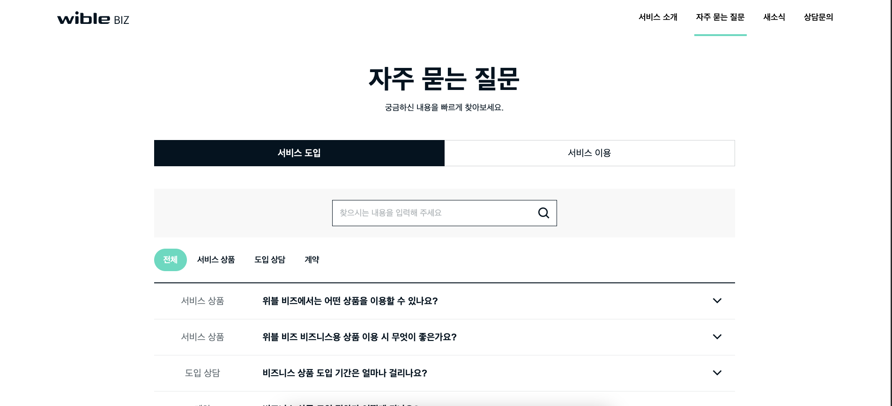

# FAQ Project

      FAQ Project는 https://wiblebiz.kia.com/FAQ 를 동일하게 만드는 것을 목적으로 한디

# Project File Tree

```js
(root)
├── .git/
├── src                             # 프로젝스 로직, 소스 구성
│   └── api                         # api
│   └── assets                      # static resource
│   └── mock                        # msw api
│   └── component                   # UI Component
│   └── router                      # SPA Router
│   └── style                       # scss style
│   └── type                        # type 정의
├── tests                           # Jest unit test 구성
└── ...
```

## 실행

```js
npm install
npm run dev
```

## 실행 화면


